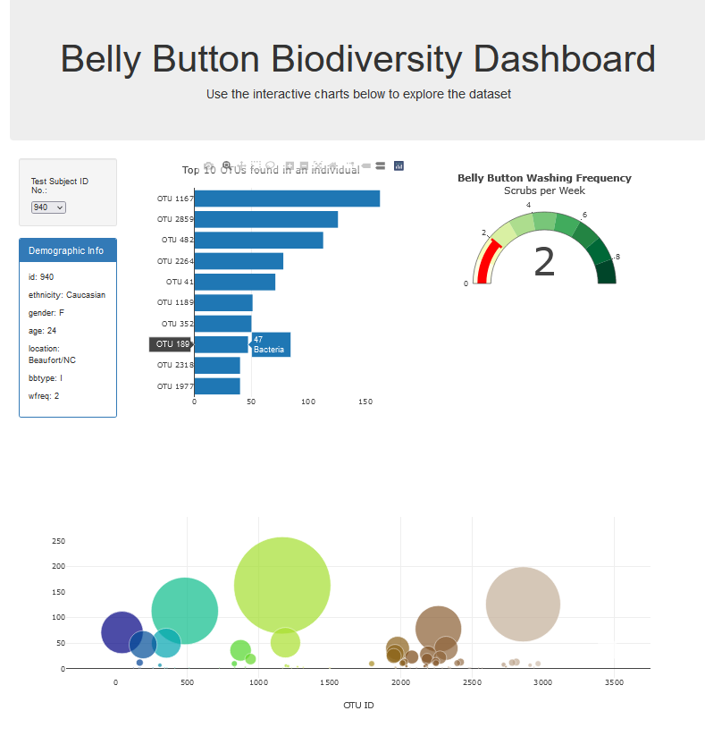

# belly-button-challenge
This is Module 14 Challenge. 

### Motivation: A small handful of microbial species (also called operational taxonomic units, or OTUs, in the study) were present in more than 70% of people, while the rest were relatively rare.
### Instructions
1. Use the D3 library to read in samples.json from the URL https://2u-data-curriculum-team.s3.amazonaws.com/dataviz-classroom/v1.1/14-Interactive-Web-Visualizations/02-
Homework/samples.json.
2. Create a horizontal bar chart with a dropdown menu to display the top 10 OTUs found in that individual.
3. Create a bubble chart that displays each sample.
4. Display the sample metadata, i.e., an individual's demographic information.
5. Display each key-value pair from the metadata JSON object somewhere on the page.
6. Update all the plots when a new sample.
* Bonus: Adapt the Gauge Chart to plot the weekly washing frequency of the individual.
  
### Attached folders and files :
* one folder including js folder including two javascript files: app.js, bonus.js
* index.html file
* snapshot.png file
* one REDME file
  
### A snapshot of my results:

  
